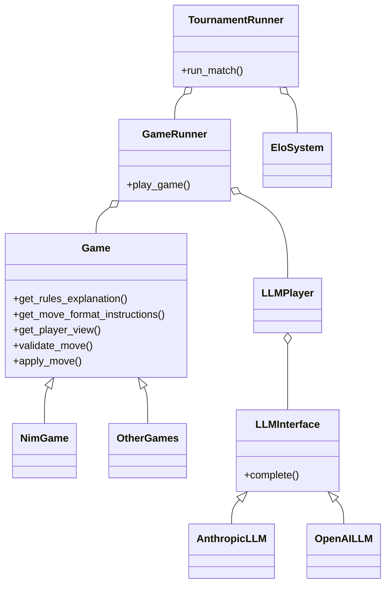

# LLM Game Evaluation Framework Design

## Architecture Overview

The framework is designed around several key abstractions that enable flexible game implementation and LLM integration while maintaining clear separation of concerns.

### Core Components

1. Game Engine
   - Game interface
   - State management
   - Move validation
   - Player views

2. LLM Integration
   - Provider abstraction
   - Conversation management
   - Move parsing

3. Rating System
   - Elo calculations
   - Uncertainty handling
   - Tournament management

## Key Design Decisions

### 1. Game State Visibility

We use a `GameView` abstraction to handle hidden information:
- Each player only sees what they're allowed to see
- Game state and player view are separate
- Prevents accidental information leaks
- Supports card games and other hidden information games

### 2. Conversation Management

LLM interactions are structured as a conversation:
- Maintains context for better decisions
- Includes game rules and move format
- Handles invalid moves through feedback
- Supports different provider message formats

### 3. Move Validation

Two-step validation process:
1. Parse: Convert text to structured move
2. Validate: Check move against game rules
- Provides clear feedback for invalid moves
- Allows retries without losing context

### 4. Async Design

The framework is async-first:
- Efficient handling of LLM API calls
- Support for parallel game execution
- Scalable tournament management

## Class Relationships



## Extension Points

### Adding New Games

1. Implement Game interface
2. Define game-specific state
3. Implement move validation
4. Define player views
5. Provide rule explanations

### Adding New LLM Providers

1. Implement LLMInterface
2. Handle provider-specific API format
3. Manage rate limits and retries
4. Handle error cases

## Future Considerations

1. Performance Optimization
   - Conversation history pruning
   - Batch game execution
   - Caching common responses

2. Analysis Tools
   - Game replay visualization
   - Performance analytics
   - Strategy analysis

3. Robustness
   - API failure handling
   - Rate limiting
   - Cost monitoring
   - Timeout handling

4. Tournament Features
   - Swiss-system tournaments
   - Round-robin automation
   - Multi-game matches
   - Variance reduction

## Implementation Guidelines

### Game Implementation

```python
class YourGame(Game):
    def get_player_view(self, state, player_id):
        # 1. Calculate visible state
        # 2. Determine valid moves
        # 3. Check game end conditions
        return GameView(...)
```

### LLM Provider Implementation

```python
class YourLLM(LLMInterface):
    async def complete(self, messages):
        # 1. Format provider-specific request
        # 2. Handle API calls
        # 3. Parse response
        # 4. Handle errors
        return response
```

## Testing Strategy

1. Game Logic
   - State transitions
   - Move validation
   - Win conditions
   - Hidden information

2. LLM Integration
   - API handling
   - Response parsing
   - Error cases
   - Rate limiting

3. Tournament Logic
   - Elo calculations
   - Match scheduling
   - Results recording

## Configuration Management

1. LLM Settings
   - API keys
   - Model selection
   - Temperature
   - Token limits

2. Game Parameters
   - Initial states
   - Rule variations
   - Time controls

3. Tournament Settings
   - Match counts
   - Pairing systems
   - Rating parameters

## Monitoring and Logging

1. Game Progress
   - Move history
   - State transitions
   - Time per move

2. LLM Performance
   - Response times
   - Token usage
   - Error rates

3. Tournament Stats
   - Rating changes
   - Win rates
   - Invalid move rates
