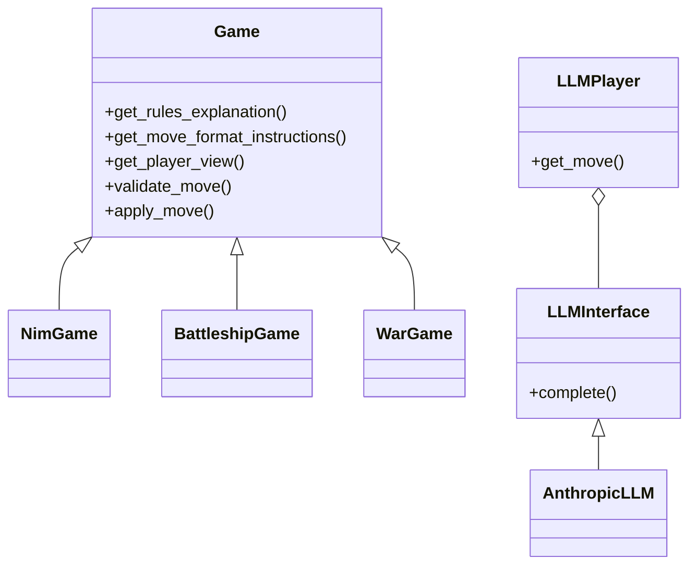

# LLM Game Evaluation Framework Design

## Architecture Overview

The framework enables flexible game implementation and LLM integration while maintaining clear separation of concerns.

### Core Components

1. Game Engine
   - Abstract Game interface
   - Game-specific state classes
   - Move validation
   - Player views through GameView

2. LLM Integration
   - Provider abstraction via LLMInterface
   - OpenRouter integration for Anthropic and OpenAI
   - Basic conversation management
   - Simple move parsing

3. Game Implementations
   - NimGame
   - BattleshipGame 
   - WarGame
   - Each with specific state classes and consistent method implementations

## Key Design Decisions

### 1. Game State & Views

Each game implements:
- get_player_view() returning GameView
- validate_move() for move checking
- get_move_format_instructions() for LLM guidance
- apply_move() for state transitions

### 2. Move Handling

Two-phase move process:
1. Validation via validate_move()
2. Application via apply_move()

### 3. LLM Integration

Basic async interface:
- complete() method for queries
- Simple message format
- Minimal error handling
- Basic retry logic implemented

## Class Relationships



## Testing Infrastructure

The framework uses a comprehensive testing strategy built on modern Python testing tools and practices.

### Core Testing Components

1. **Test Framework**
   - pytest as the primary testing framework
   - pytest-asyncio for testing async code
   - pytest-mock for dependency mocking
   - conftest.py providing common fixtures

2. **LLM Testing**
   - pydantic-ai TestModel for LLM simulation
   - Captured message flows for verification
   - Mocked database sessions
   - System prompt consistency checks

3. **Game Testing**
   - Comprehensive game logic validation
   - State transition verification
   - Move validation testing
   - Win condition checks
   - Edge case handling

### Test Organization

Tests are organized by component:

1. **Game Logic Tests**
   - NimGame (complete)
   - BattleshipGame (complete)
   - WarGame (complete)
   - Move validation
   - State transitions
   - Win conditions

2. **LLM Integration Tests**
   - LLMPlayer interactions (complete)
   - Move generation
   - Error handling
   - Database logging
   - System prompt consistency

3. **Infrastructure Tests**
   - Database operations
   - Configuration handling
   - Error conditions
   - Edge cases

### Best Practices

1. **Test Isolation**
   - Each test focuses on one component
   - Dependencies properly mocked
   - Clean state between tests
   - Async support where needed

2. **Mocking Strategy**
   - External APIs always mocked
   - Database operations simulated
   - File system interactions controlled
   - Time-dependent operations managed

3. **Coverage Goals**
   - Critical paths fully covered
   - Edge cases included
   - Error conditions tested
   - Integration points verified

### Test Maintenance

1. **Regular Updates**
   - Tests updated with code changes
   - Coverage monitored
   - Documentation maintained
   - Edge cases reviewed

2. **Quality Assurance**
   - Consistent naming conventions
   - Clear test purposes
   - Proper setup/teardown
   - Meaningful assertions

3. **CI Integration**
   - Automated test runs
   - Coverage reports
   - Performance monitoring
   - Regression detection

## Current Status

1. Core Features Implemented
   - Game state management
   - Player tracking
   - Basic error handling
   - Move validation
   - Game completion tracking
   - Rating system
   - Win/loss statistics

2. Database Features
   - Experiment tracking
   - Player statistics
   - Game state history
   - LLM interaction logging
   - Win matrix generation
   - Concession handling

3. Remaining Limitations
   - Tournament management not implemented
   - Game analysis tools incomplete
   - Performance optimization needed
   - GameView usage varies between games

## Next Steps

1. Standardization
   - Consistent GameView usage
   - Uniform move validation
   - Standard error handling

2. Core Improvements
   - Add retry logic to LLMs
   - Improve error messages
   - Better move validation

3. Future Features
   - Basic tournament support
   - Simple rating system
   - Game replay capability in progress

## Implementation Guidelines

### Game Implementation

```python
class YourGame(Game):
    def validate_move(self, state, player_id, move):
        # Validate move legality
        pass
        
    def get_move_format_instructions(self):
        # Return move format help
        pass
        
    def get_player_view(self, state, player_id):
        # Return GameView for player
        pass
```

### Testing Focus

1. Game Logic
   - Move validation
   - State transitions
   - Win conditions

2. LLM Integration
   - Basic API handling
   - Response parsing
   - Simple error cases

## Configuration

1. LLM Settings
   - API keys
   - Model selection
   - Basic parameters

2. Game Parameters
   - Initial states
   - Basic rules

## Monitoring

1. Game Progress
   - Move history
   - Basic state logging

2. LLM Performance
   - Response times
   - Error tracking
