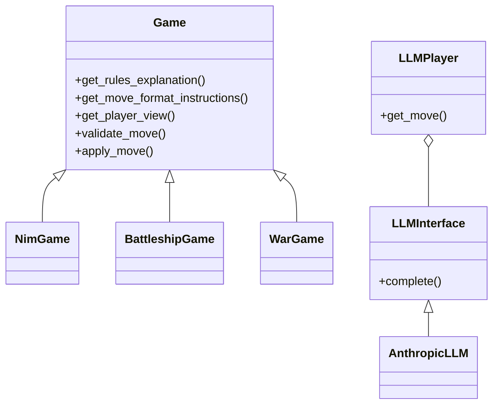

# LLM Game Evaluation Framework Design

## Architecture Overview

The framework enables flexible game implementation and LLM integration while maintaining clear separation of concerns.

### Core Components

1. Game Engine
   - Abstract Game interface
   - Game-specific state classes
   - Move validation
   - Player views through GameView

2. LLM Integration
   - Provider abstraction via LLMInterface
   - OpenRouter integration for Anthropic
   - Basic conversation management
   - Simple move parsing

3. Game Implementations
   - NimGame
   - BattleshipGame 
   - WarGame
   - Each with specific state classes

## Key Design Decisions

### 1. Game State & Views

Each game implements:
- get_player_view() returning GameView
- validate_move() for move checking
- get_move_format_instructions() for LLM guidance
- apply_move() for state transitions

### 2. Move Handling

Two-phase move process:
1. Validation via validate_move()
2. Application via apply_move()

### 3. LLM Integration

Basic async interface:
- complete() method for queries
- Simple message format
- Minimal error handling
- No retry logic yet

## Class Relationships



## Current Limitations

1. Error Handling
   - Basic error checking only
   - No retry mechanism
   - Limited validation feedback

2. Missing Features
   - Tournament management
   - Rating system
   - Game analysis tools
   - Performance optimization

3. Inconsistencies
   - GameView usage varies
   - Move validation not uniform
   - Error handling differs

## Next Steps

1. Standardization
   - Consistent GameView usage
   - Uniform move validation
   - Standard error handling

2. Core Improvements
   - Add retry logic to LLMs
   - Improve error messages
   - Better move validation

3. Future Features
   - Basic tournament support
   - Simple rating system
   - Game replay capability

## Implementation Guidelines

### Game Implementation

```python
class YourGame(Game):
    def validate_move(self, state, player_id, move):
        # Validate move legality
        pass
        
    def get_move_format_instructions(self):
        # Return move format help
        pass
        
    def get_player_view(self, state, player_id):
        # Return GameView for player
        pass
```

### Testing Focus

1. Game Logic
   - Move validation
   - State transitions
   - Win conditions

2. LLM Integration
   - Basic API handling
   - Response parsing
   - Simple error cases

## Configuration

1. LLM Settings
   - API keys
   - Model selection
   - Basic parameters

2. Game Parameters
   - Initial states
   - Basic rules

## Monitoring

1. Game Progress
   - Move history
   - Basic state logging

2. LLM Performance
   - Response times
   - Error tracking
